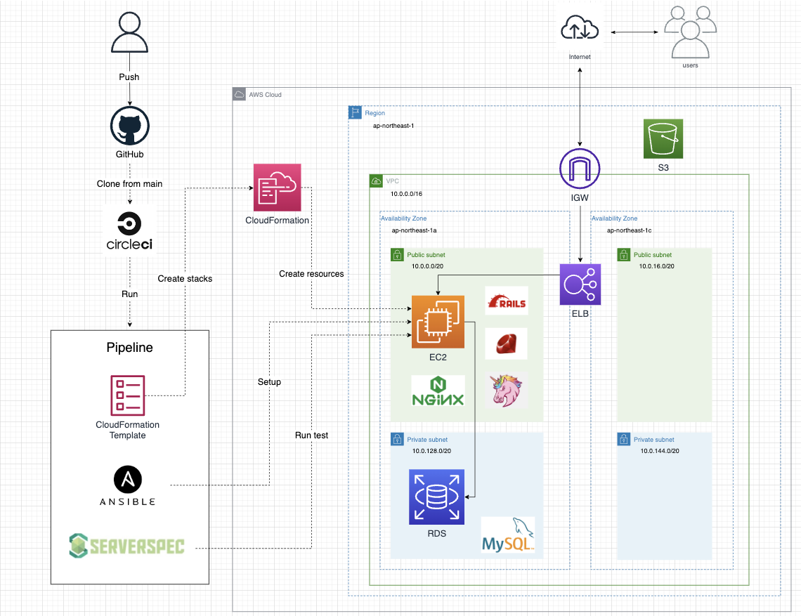

# RaiseTech　AWSフルコース　課題提出用リポジトリ

## 概要

- RaiseTechのAWSフルコースを受講した際の課題提出用のリポジトリです。
- 各講義で出題された課題はマークダウンファイルにまとめて提出しました。  
（例）第10回目の講義課題 → lecture10.md

## 最終課題終了時のAWS構成図

## 作成ファイルおよび内容

| 　File Name   | Contents |
| :-----------: | :--------------------------------------------------------: |
| lecture02.md | Githubアカウント作成　プルリクエスト発行　Markdown記法 |
| lecture03.md | Cloud9でのRuby on RailsによるWebアプリケーションのデプロイ |
| lecture04.md | VPC、EC2、RDSの構築 |
| lecture05.md | EC2上でのサンプルアプリケーションのデプロイ  AWS構成図 |
| lecture06.md | ログ　アラーム　コスト管理 |
| lecture07.md | セキュリティー対策　脆弱性 |
| lecture10.md | インフラの自動化　Cloudformation |
| terraform.md | インフラの自動化　Terraform |
| lecture11.md | インフラの自動テスト　ServerSpec |
| lecture12.md | CI/CDツール　CircleCI |
| lecture13.md | Ansibleの導入　環境設定及びインフラ構築の自動化処理 |
| lecture14.md | 最終課題終了時のAWS構成図 |
| cloudformation -template | lecture10~13で作成・使用したテンプレートファイル格納 |
| terraform | tfファイル格納 lecture10のTerraformバージョン　|
| .circleci    | 第12,13回課題で作成したCircleCIのconfig.yml格納 |
| ansible   ansible.cfg | 第13回課題で作成したAnsibleのコード |
| serverspec   | 第11,13回課題で作成・使用したServerSpecの設定ファイル |
| images | 画像保管場所 |
