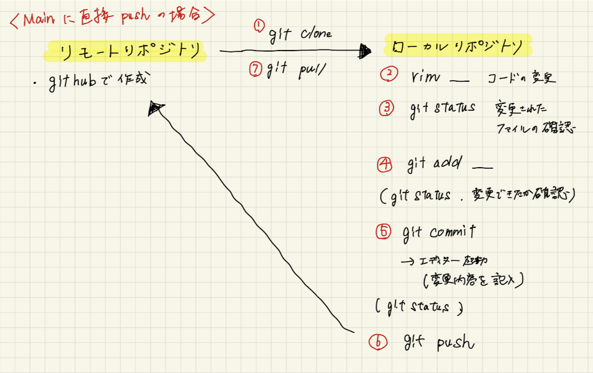

# 第2回課題提出

## 講座での学び

- 動画と同じように作業したが、同じようにはならなかったり、異なる場面がどんどん出てくるのが大変でした。
- その度に調べるが、調べるたびに不明な単語や選択肢に困ることが多いが学びに広がりは出てくるように感じました。
- かなり何となくの理解が続いている。しかし、第１回の講座では、「とにかく終わらせること、深めるのはその後」という言葉もあったのでまずはやり切るようにしたいです。
- ローカルにpullする際に、mainブランチに切りかえる必要があることに気がつくまでに時間がかかった。切ったブランチをマージした後、基本的にはそのブランチは削除した。

## GitHubでのプルリクエスト

- プルリクエストを行うまでの今回の操作手順を以下のノートにまとめた。内容理解及び情報の整理に役立った。

