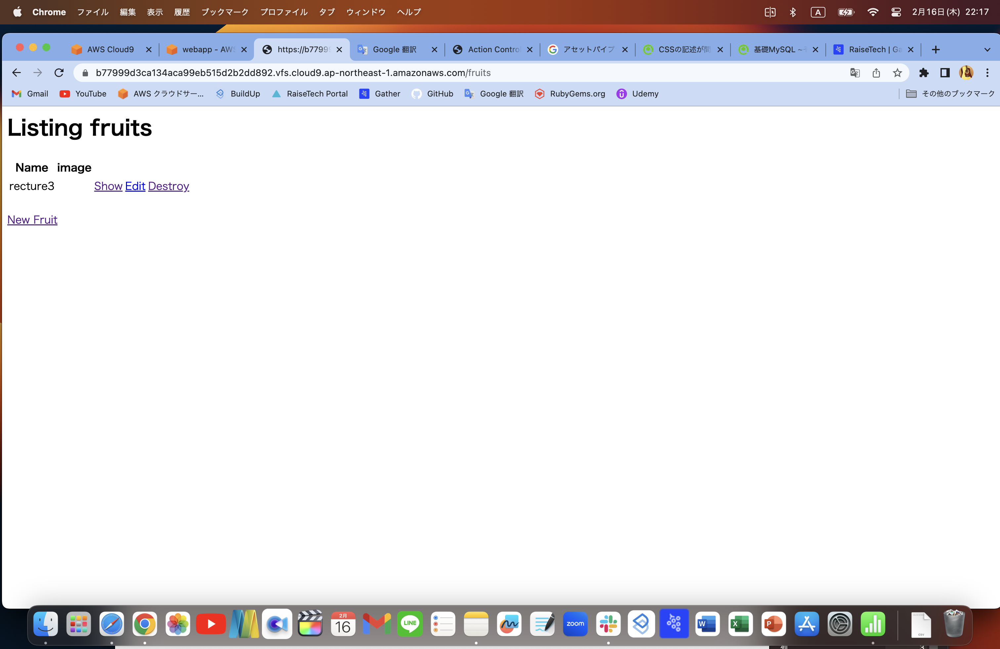
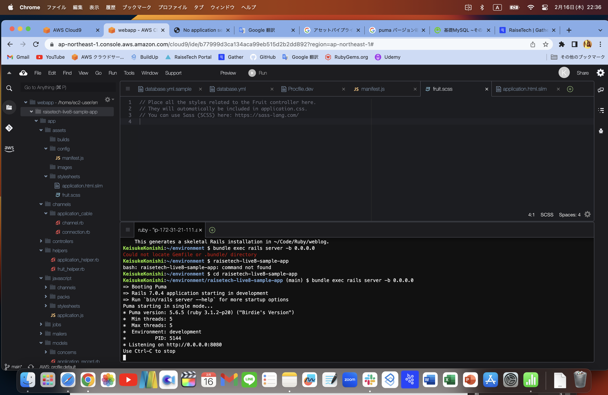
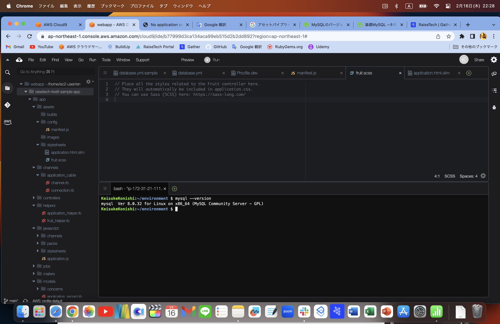
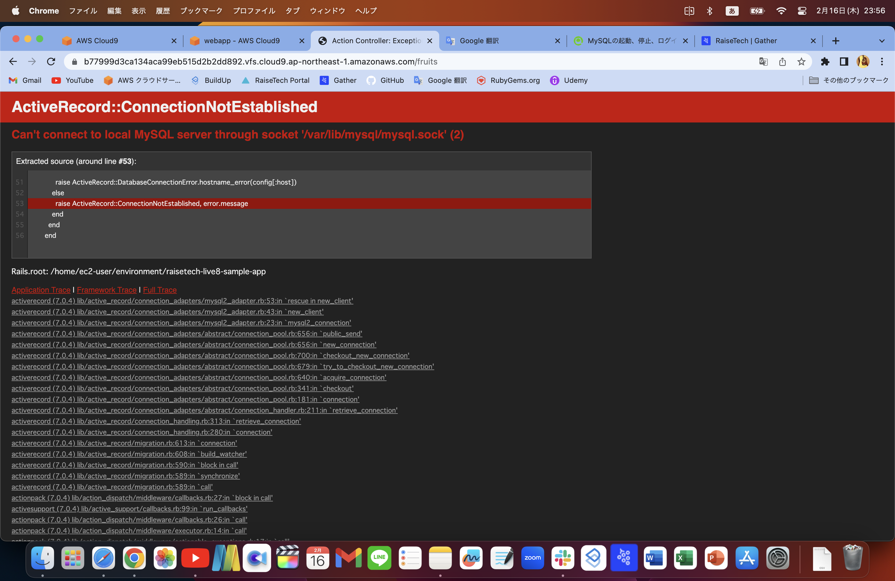

# 第3回課題提出

## アプリケーションの起動

- cloud9を使用してサンプルアプリケーションのデプロイを行う。
  
  ブラウザでアクセスできる状態を確認。

## APサーバーについて

- APサーバーの名前とバージョンの確認。  
puma version 5.6.5

- APサーバーを終了させた場合、引き続きアクセスできるか。  
サーバーの停止後はアクセス不可

## DBサーバーについて

- サンプルアプリケーションで使ったDBサーバーの名前と、今、cloud9で作動しているバージョンはいくつか確認。  
mysql Ver 8.0.32
- DBサーバーを終了させた場合、引き続きアクセスできるか。  
サーバ終了後はアクセス不可

## Railsの構成管理ツールの名前は何か

- bundler

## 　今回の課題から学んだこと

webアプリケーションの起動までをひと通りやってみたが、かなり機械的に操作しただけで内容の把握はほとんどできていない。「APサーバーが何か」といった言葉一つ一つの理解は少しできた。  
起動までに必要なこと、データーベース、ruby　on rails、yarnのインストールなど流れは把握。  
ファイルの中の変更に関しては何を変えれば何が起こるか全くわからず、また書き換えると戻すことができないと言う不安からあまり触ることができなかった。  
基本的に動画の通り進めていったが、アセットパイプラインに関するエラーに関しては同じようにしても解決しなかった。結局、検索途中に同じようなエラーにハマった人の解決法ほの中に、このファイルを移動すると解決したという記事を見つけ、その通りにすると解決した。だが、なぜ解決したのかは不明。どのあたりまで理解してこの課題を終えて良いのかよくわからないままの提出となったが、学習を進めていく中で新たな知識と共にいつかまた振り返っていきた
いと思います。
