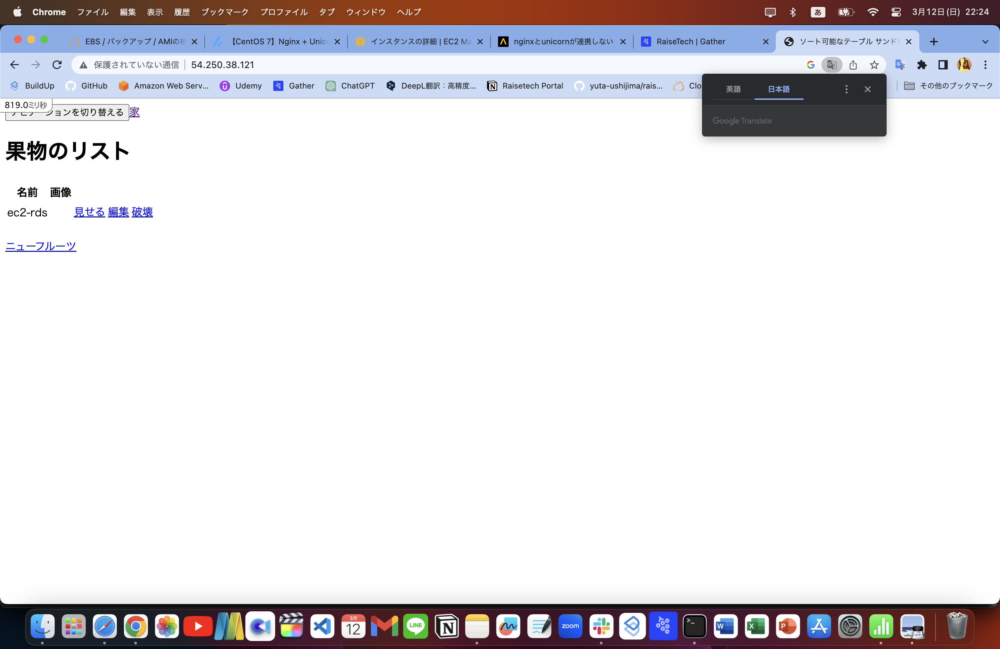
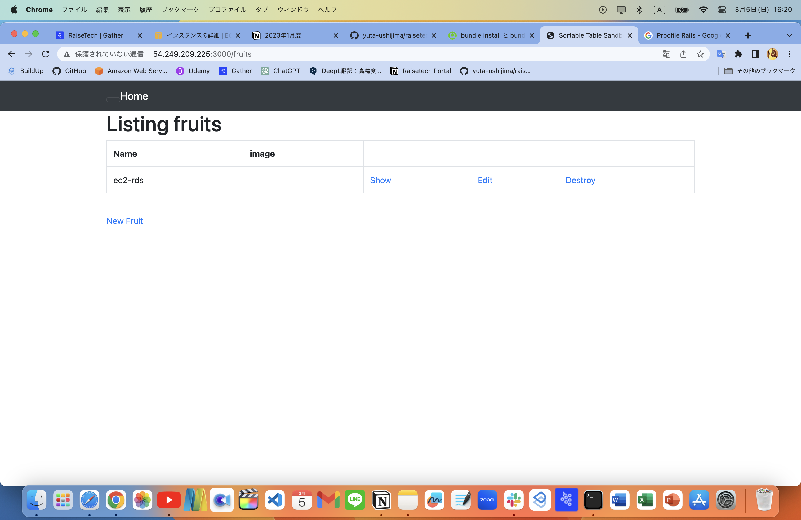
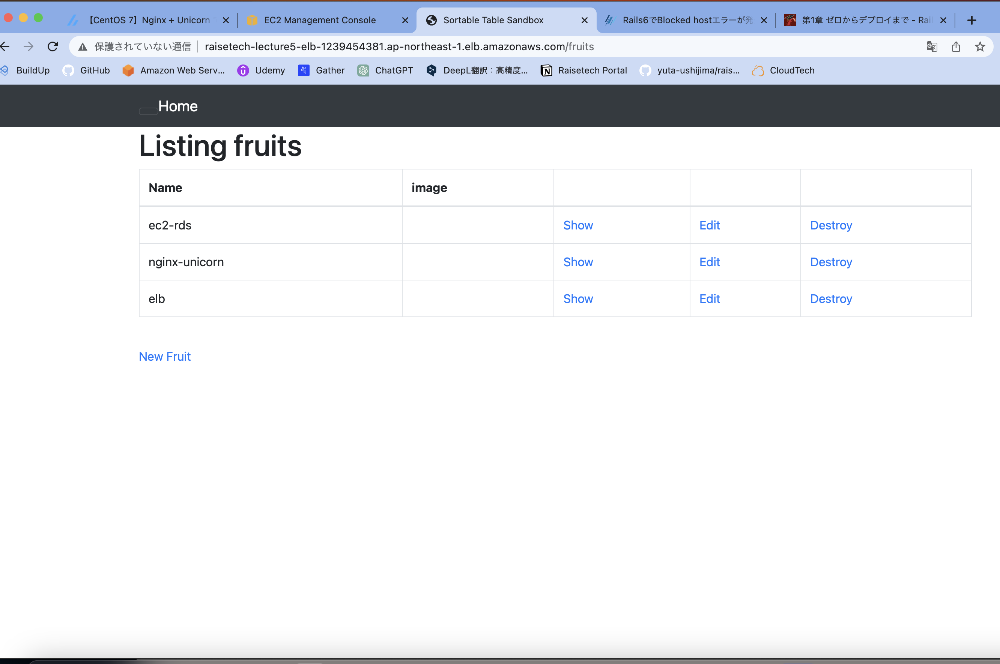
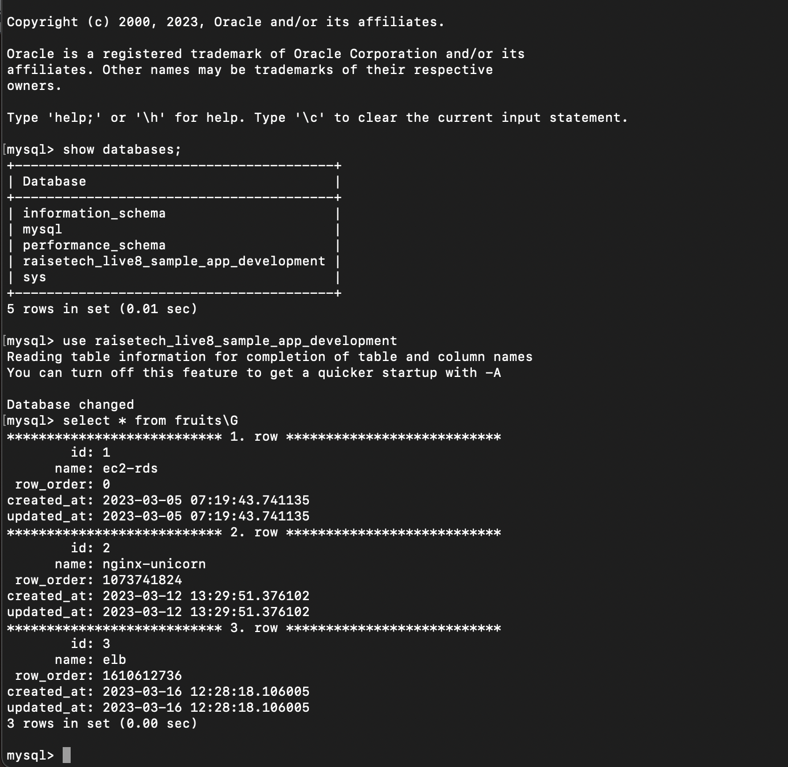
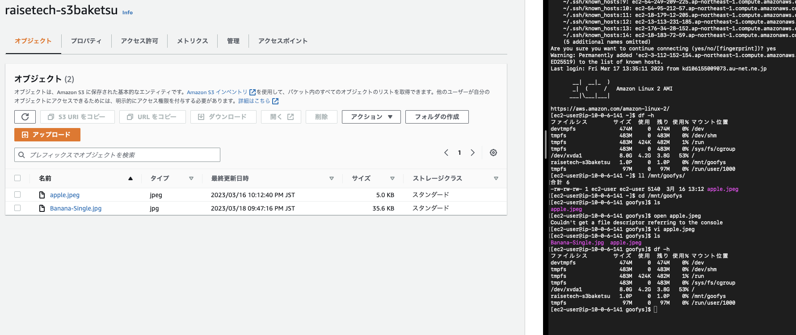
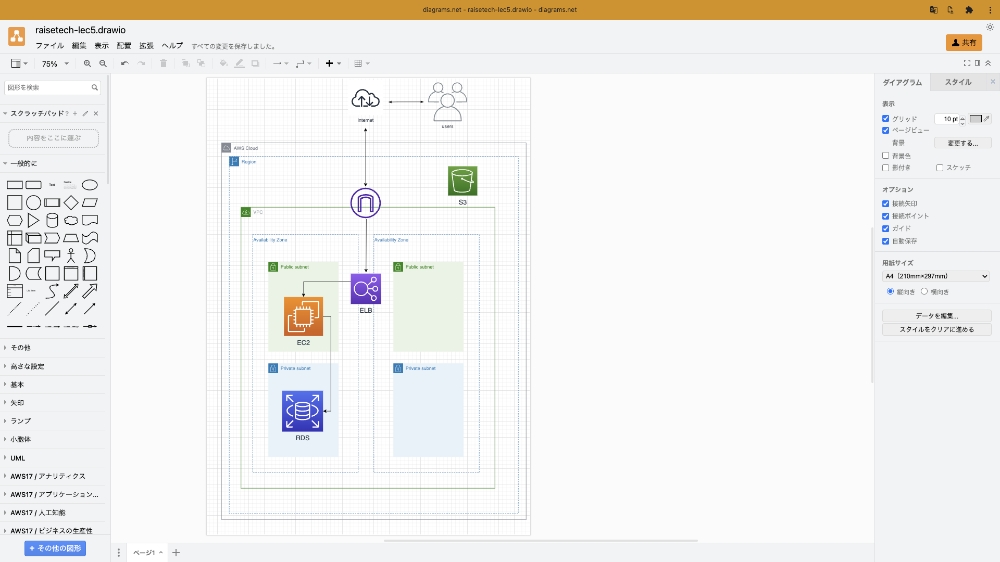

# 第5回課題提出

## EC2上にサンプルアプリケーションをデプロイして作動させる

- 組み込みサーバーだけでデプロイ

- nginxとunicornに分けてデプロイ

## ELBを追加してデプロイ

## Databaseで確認

## S3の追加

- EC2に直接マウントして、S3と連携したEC2上からファイルを消したり、追加したりした際に、バケットに反映されているか確認した。
- active storageに使用する方法も現在挑戦中。

## 今回構築した環境を構成図に書き起こす

