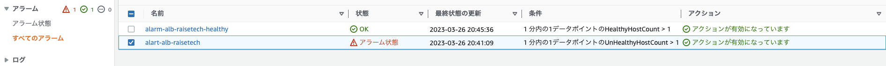
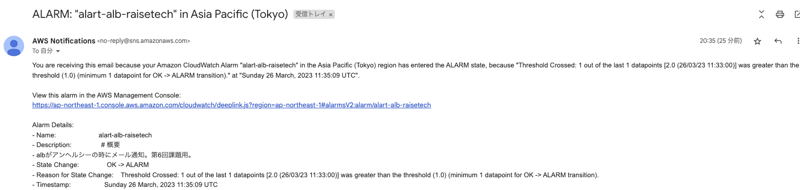
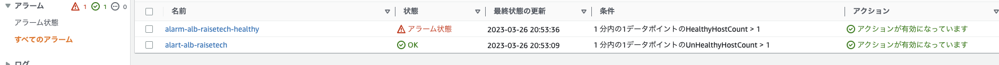
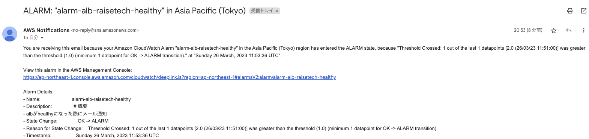
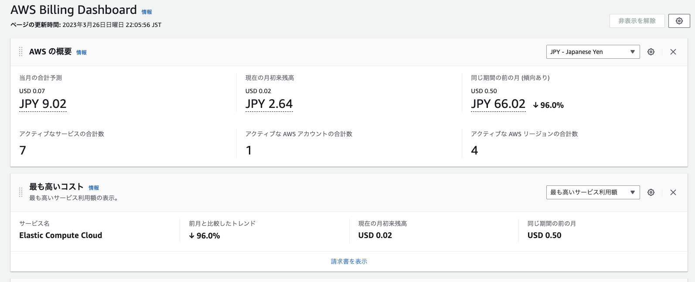
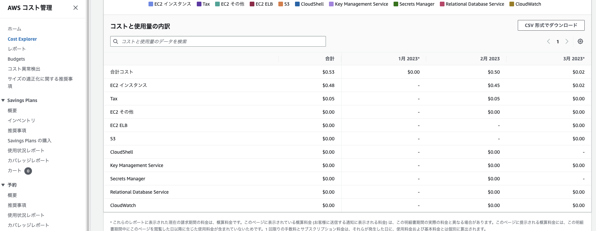
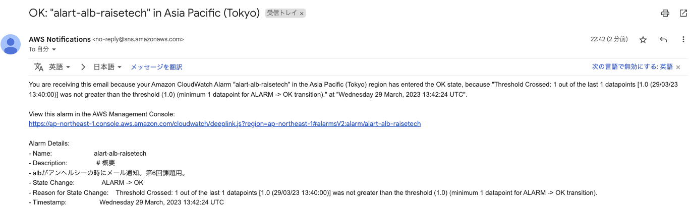

# 第６回課題提出

## CloudTrailのイベント

＜EC2インスタンスを停止させた記録＞  

- イベント名　stopInstances
- イベント時間　March 26, 2023, 14:14:52 (UTC+09:00)
- リソースタイプ　AWS::EC2::Instance
- リソース名　i-02cef2de6a70f9591
- AWS リージョン　ap-northeast-1
- その他の情報　発信元 IP アドレス、イベント ID、リクエスト ID

## CloudWatchアラームを使ってALBのメール通知

- unhealthy

- healthy

## AWS利用料の見積もり

[https://calculator.aws/#/estimate?id=606fcc1c006e3ed3e48af83ec9ed44572bea27ec]

## 現在の利用料

EC2の料金  
→ 無料枠で収まっていない。

## メール通知(alerm→OK)を追加

