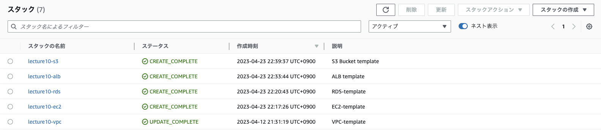
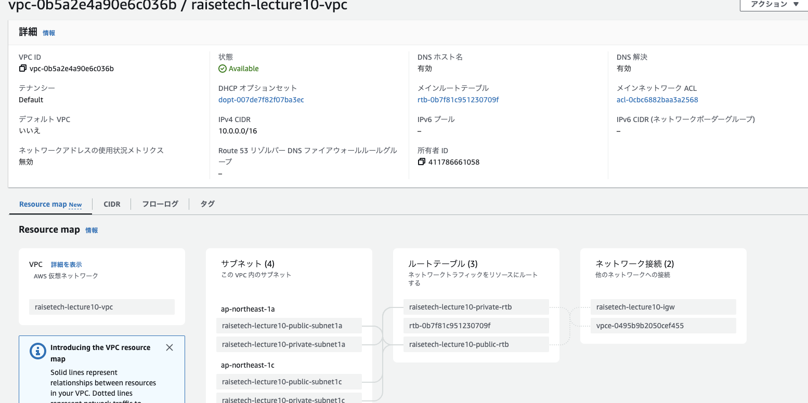
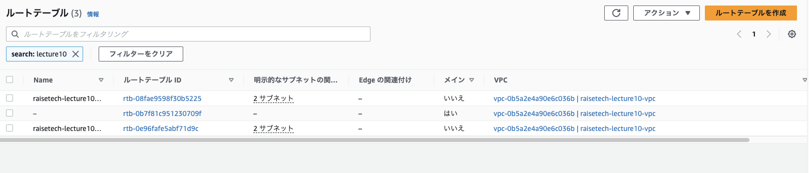
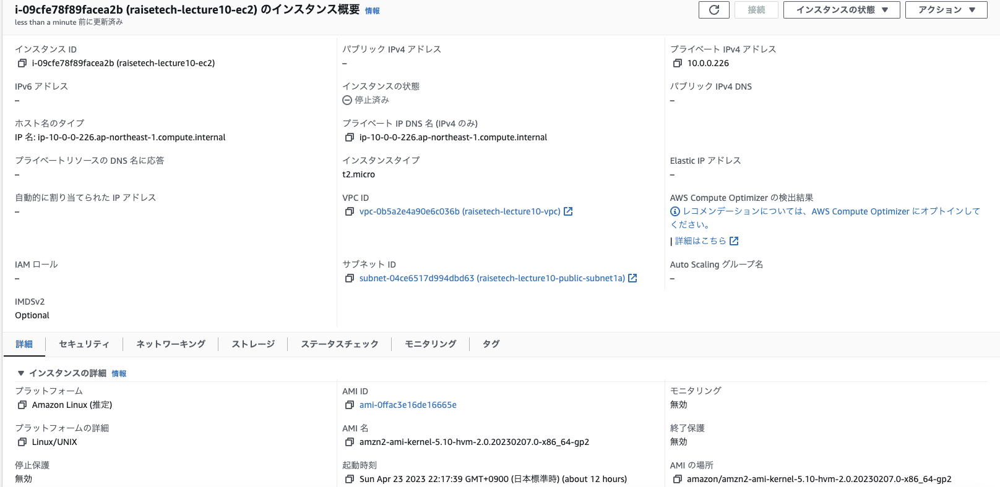
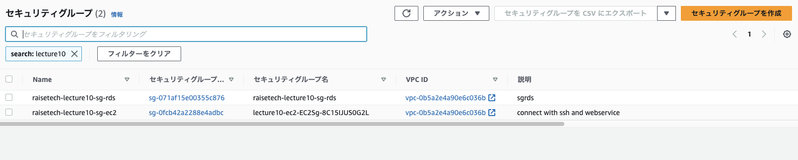
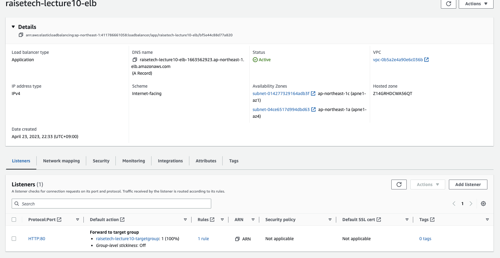
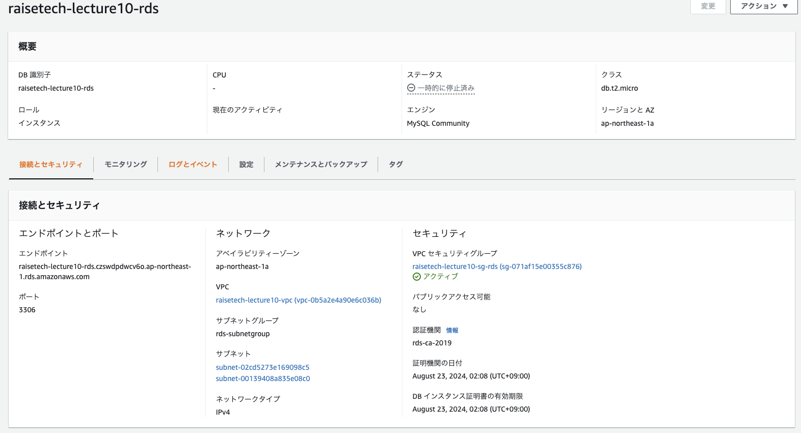
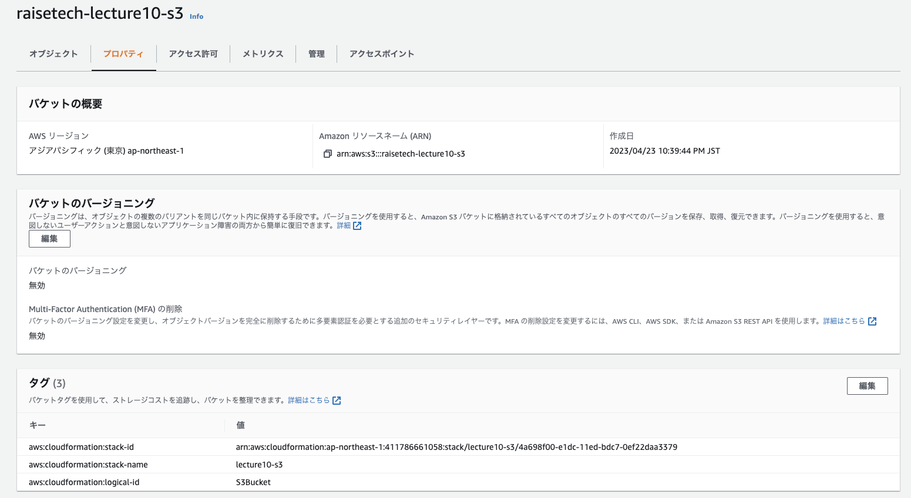

# 第10回課題提出
## CloudFormationを利用して現在までに作った環境のコード化し、環境が自動で作られているか確認. 
- スタック

- VPC

- ルートテーブル

- EC2

- セキュリティーグループ

- ロードバランサー

- RDS

- S3

## 感想
組み込み関数があまり理解できていない。さまざまな記事でコードを調べていると組込み関数を使った複雑な書き方があり、理解が難しかったため、とりあえず!Ref,!SUbを所々で使う程度で作成した。  
parametersなどの記述を使ったものなど、もう少し書き方に工夫ができるようなので引き続き理解を深めたい。
今までの環境を設定することで、VPCやEC2を一つ作るにしても様々なことが、自動で良いように設定されていることに気がつき、理解を少し深めることができた。

