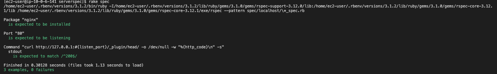

# 第11回課題提出
## ServerSpecのテストを成功させる
- ServerSpecをインストール
- serverspec-initコマンドを使ったテストスクリプトの作成

- sample_spec.rbを設定

Nginxがインストール済であること. 

指定のポートがリッスン（通信待ち受け状態）であること

テスト接続して動作すること

require 'spec_helper'

listen_port = 80

describe package('nginx') do

it { should be_installed }
 
end

describe port(listen_port) do

it { should be_listening }

end

describe command('curl http://127.0.0.1:#{listen_port}/_plugin/head/ -o /dev/null -w "%{http_code}\n" -s') do

its(:stdout) { should match /^200$/ }

end

- テスト成功

- 感想

今回は、与えていただいたサンプルテストコードのみを実行したが、様々なテスト方法があるようなので今後考えて使っていけるようにしたい。
