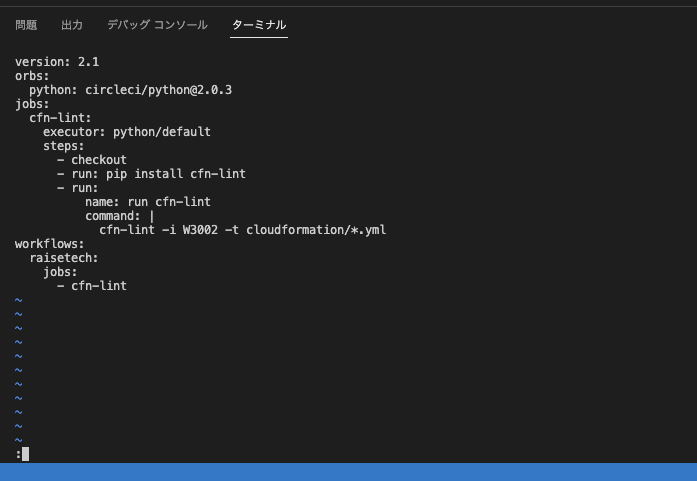

# 第１２回課題提出
## CircleCIのサンプルコンフィグを正しく作動するようにリポジトリに組み込む
<実行した手順>

1.CircleCIのユーザー登録をGitHubで登録

2.GitHubで今回の課題用のリポジトリ（lecture12)を作成

3.自分のPC（ローカル）へクローンする

4.CircleCIで作成したGitHubのリポジトリと連携させる

5.GItHub上でプルリクエストが作成された（config.ymlが追加された）

6.マージする

7.ローカルへpull

8.Lecture12にcloudformationという名前のフォルダを作成し、中に第10回で作成したymlファイルを入れる
config.ymlを与えられたサンプルコンフィグに書き換える

9.それぞれ追加変更したファイル等をadd.commit.push

10.CircleCIでテストが成功し、正しく作動していることを確認

## 感想など
- Cloudformationの中にymlファイル以外が入っているとエラーになる？？ようで気がつくまでに時間がかかった
- .circleCIの中にconfig.ymlが作成されていたので、lsコマンドで.circleCIが出てこないことに戸惑った。なぜかくしファイルで作られるのか、、、。
- ymlファイルの位置のパスが間違っており、何度かエラーとなった。なぜかパスがうまくいかなかったので、諦めてlecture12にcloudformatinのファイルを作った。