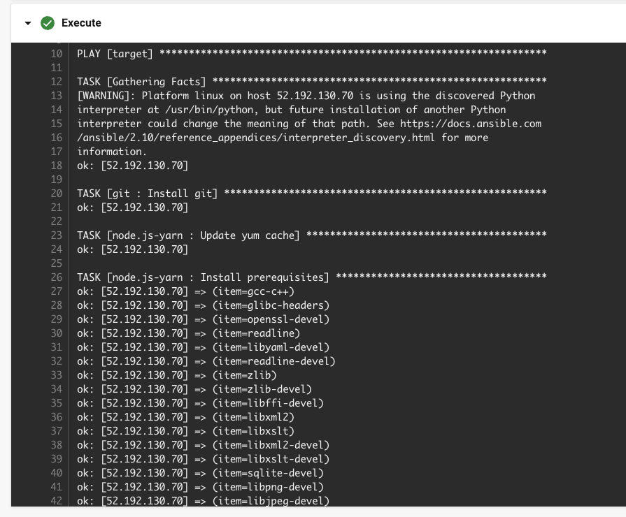
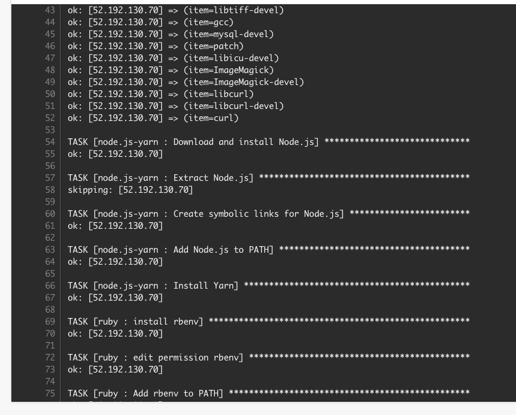
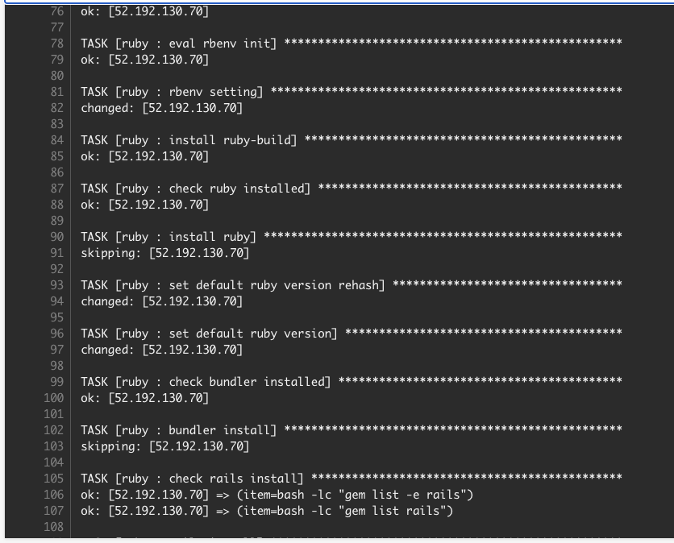
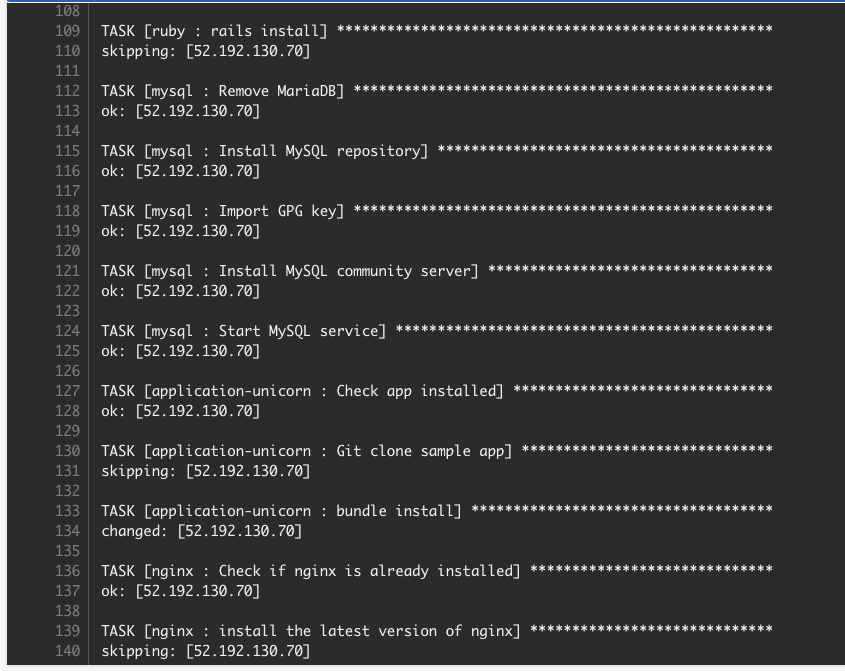
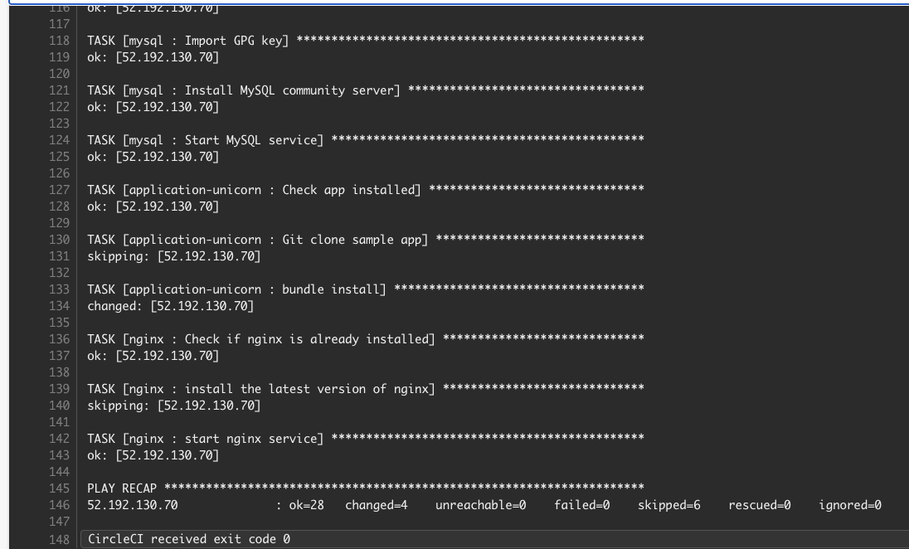
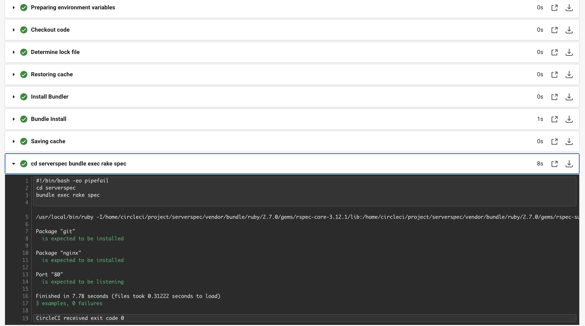

# 第１３回課題提出

- CircleCIのサンプルにServerSpecやAnsibleの処理を追加

## ①Ansibleの設定

1. 自分のPCにansibleをインストール。（homebrew使用）
2. ホームディレクトリにlecture13ファイルを作成し、その中にInventry、Playbook.yml、ansible.cfgを作成。
3. 第10回のcloudformationで作成したEC2にSSH接続。
4. InventoryにEC2のipアドレスを記述。名前をtargetとした。
5. ansible target -i inventory --private-key=./CFnKeyPair.pem -m ping -u ec2-userを打ち、疎通確認（鍵の情報がないため、１回目はエラーとなった）
6. 上の別の方法としてInventoryに[target:vars]の中にキー情報を記入する方法も確認できた。

7. targetのEC2にgitをインストールするために、playbook.yml記述し、ansible-playbook -i inventory playbook.ymlを実行（git-install.png）
8. gitがインストールできていることを確認し、CircleCIとの連携へ進んだ。

## ②CircleCIの設定

1. CircleCIとGitHubのリポジトリを連携し、.circleci/config.ymlを自動作成。プルリクエストが送られているので確認してマージ。mainブランチをローカルにpull。
2. ローカルでブランチを切って編集。
3. 第１０回で作成したcloudformationのymlファイルとconfig.ymlをとりあえず第12回と同じものにして（課題12回の復習も兼ねました）、リモートにpush。
4. CircleCIが動いていることを確認後、マージし、ローカルにpull。ここからさらに編集を進めて言った。
5. config.ymlにcloudformationを実行するように書き込む。cloudformationを実行するのはAWS CLIが必要なのでorbsを用いて設定。
6. 以下の環境変数をCircleCIに定義する。Project SettingsのEnvironment Variablesに書き込んでいく。  
aws-access-key-id: AWS_ACCESS_KEY_ID.  
aws-secret-access-key: AWS_SECRET_ACCESS_KEY.  
aws-region: AWS_DEFAULT_REGION  
7. 6を定義するために、AWSのマネジメントコンソールからIAMで作成したIMAユーザーのアクセスキー作成。6に書き込む。
8. pushしcloudformationが実行されるか確認。CircleCIでも確認。
9. 8のエラーでかなり詰まる。Circle CIではエラーとなるがなぜかcloudformationで直接スタックを作ると成功する。IAMの権限の問題で解決した。

10. ①で作成したInventry、Playbook.yml、ansible.cfgを課題提出用リポジトリにコピー。ロールも作成し、gitのインストールの記述もその中のmain.ymlにコピー。
11. config.ymlにansibleを実行するように書き込む。  
12. ssh接続のためにcircleciにsshのホスト名(target)とキーペア情報の入力。fingerprint使用。  
13. pushし確認。orbが使えないと警告が出る。（CircleCIでのセキュリティーの設定で改善）  
14. 無事にansibleが実行されていることを確認。  

## ③Serverspecの設定

1. serverspecをcircleciで実行。まずは、ローカルで必要なファイル（sample_spec.rbなど）を作成した（課題11ではserverspec-initというコマンドを使うと雛形ができたが、今回は手動で作成。中に何を記述するかまではsample_spec.rb以外は不明な点が多かったので、以前の内容をコピーした）
2. serverspecがcircleciで走るかを確認するために、gitがインストールできているかだけをテスト項目とし、実行。
3. 課題11の影響で、sample_spec.rbを格納しているファイルがlocalhostのままでエラーが出たので、EC2のIPアドレスに変更し、実行することで成功。

## これまでの課題で環境構築したものを全て自動化していく

- 上記①〜③より、CircleCIによってCloudformation,ansible,Serverspecが実行できたことを確認できた。  
よって、ここからさらに以下の手順でこれまで作成してきた環境を自動化して構築できるように設定。（①ansibleの設定の続き）

○ 設定順序  

1. gitインストール(2.39.2)　これは①で実行済み
2. node.jsインストール(v17.9.1)
3. yannインストール(1.22.19)
4. rubyインストール(3.1.2)、rails(7.0.4)インストール
5. mysqlインストール
6. サンプルアプリケーションをclone、bundlerインストール(2.3.14)
7. unicornインストール
8. nginxインストール

- 1〜8までの最終の成功確認  

- serverspecにいくつかテストを追加・確認

## 感想

- 自動化という違いはあるが、同じことを記述しているにもかかわらず、今までの課題で出た以外のエラーが発生することが多く大変であった。（特にrubyのインストール）
- 権限の部分でのミスが多かった。その部分でまだ理解できていないところが多く強い権限に頼ってしまう。
- 別のコードで表現するとうまくいくことが多かったが、そのエラーが出たコードの何が原因だったかは基本的には理解できなかった。
- arbsの使用で、何を記述していけば良いか理解が難しい。
- コードだけで処理していく場合でも図やファイルの構成などできるだけ自分の中で可視化していくことが大切だと感じた。
