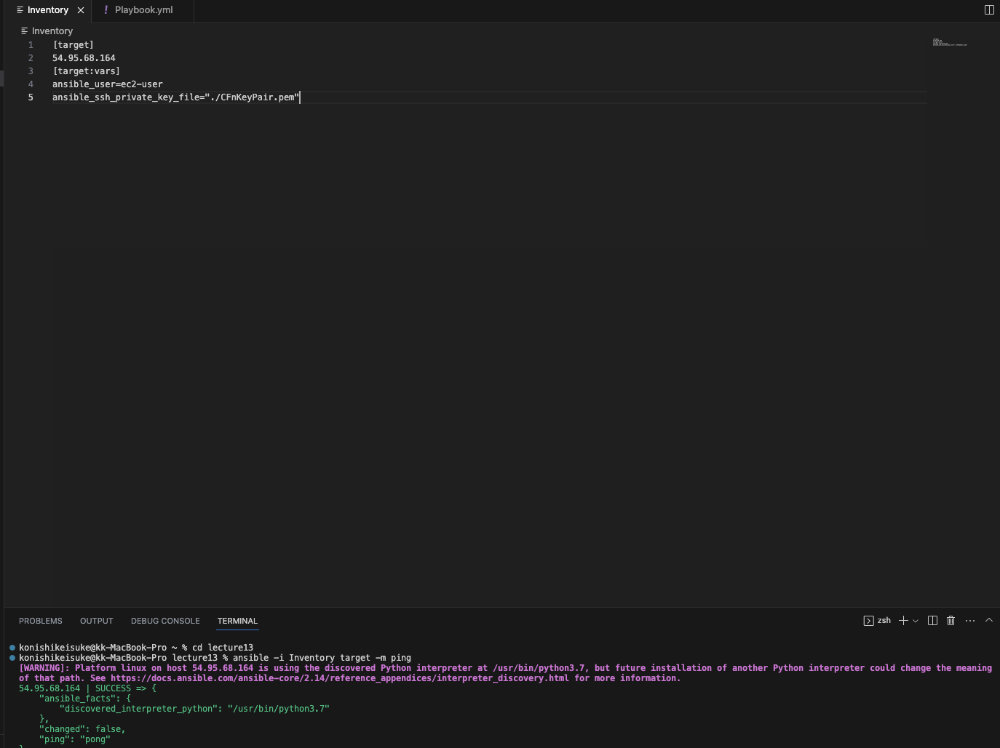
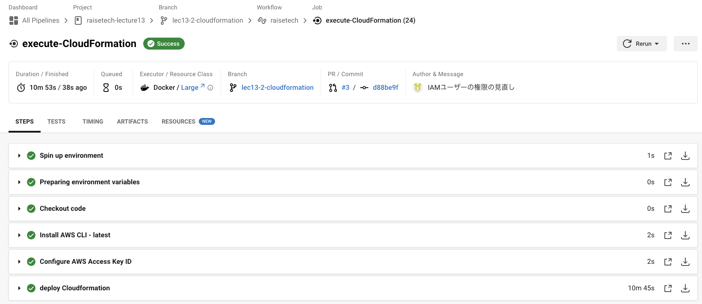
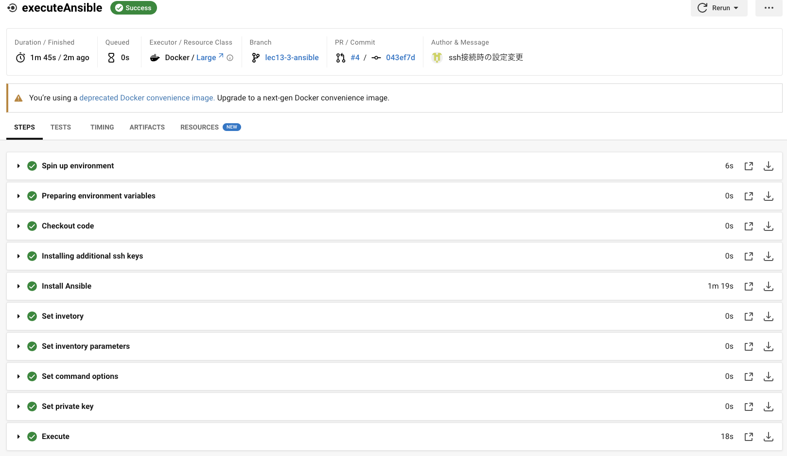
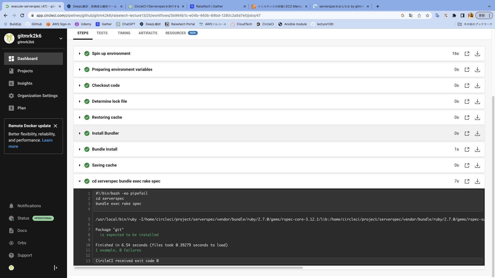

# 第１３回課題提出

- CircleCIのサンプルにServerSpecやAnsibleの処理を追加

- 今回はCircleCIでそれぞれの処理が動くかどうかを重視するために、簡単な設定やテストに留めておいた。  
例としてansibleではgitのインストールのみを実行。他にもnginxのインストールなども行い正常に動くことを確認したが、今回はコメントアウトしている。今後、アプリケーションのデプロイまで自動化したいと考えている。

## Ansibleの設定

1. 自分のPCにansibleをインストール。（homebrew使用）
2. ホームディレクトリにlecture13ファイルを作成し、その中にInventry、Playbook.yml、ansible.cfgを作成。
3. 第10回のcloudformationで作成したEC2にSSH接続。
4. InventoryにEC2のipアドレスを記述。名前をtargetとした。
5. ansible target -i inventory --private-key=./CFnKeyPair.pem -m ping -u ec2-userを打ち、疎通確認（鍵の情報がないため、１回目はエラーとなった）
6. 上の別の方法としてInventoryに[target:vars]の中にキー情報を記入する方法も確認できた。
 

7. targetのEC2にgitをインストールするために、playbook.yml記述し、ansible-playbook -i inventory playbook.ymlを実行（git-install.png)
8. node.jsインストール。インストール自体はできたが、バージョンが指定できずかなり苦労。レクチャー5でデプロイした環境と同じにしようとバージョンを17.9.1に変えたかったがこれに8時間浪費。nvmのインストールの際にかなりエラー。コードも複雑になってしまった。
9. 8を冪等性を担保するように変更。モジュールを一部変更したりした。
10. タスクがかなり長くなったので、ロールを作成し、実行できるか確認した。
11. nginxのインストール。これも冪等性を担保する方法を見つけるのに時間がかかった。
12. mysqlのインストール。初期パスワードを変更しようとしたが、暗号化等複雑になりそうなのと、セキュリティーの考え方をアドバイスいただいた結果とりあえずそのままにした。
13. 第３回課題でのサンプルアプリケーションをクローン。
14. railsのインストール。時間がかかり、ssh接続のタイムアウトが起こっていたようでなかなかタスクが進まず苦戦。
15. unicornのインストール。とりあえずここまでやってCircleCIと連携進んだ。

## CircleCIの設定

1. Githubで「raisetech-lecture13」リポジトリを作成し、ローカルにクローン。
2. circleCIとgithubのraisetech-lecture13を連携し、.circleci/config.ymlを自動作成。プルリクエストが送られているので確認してマージ。mainブランチをローカルにpull。
3. ローカルでブランチを切って編集。ブランチ「lec13-1」
4. 第１０回で作成したcloudformationのymlファイルとconfig.ymlをとりあえず第12回と同じものにして（課題12回の復習がてら）git push
5. circleCIが動いていることを確認後、マージし、ローカルにpull。ここから編集を進めていく。
6. config.ymlにcloudformationを実行するように書き込む。cloudformationを実行するのはAWS CLIが必要なのでorbsを用いて設定。
7. 以下の環境変数をcircleCIに定義する。

Project SettingsのEnvironment Variablesに書き込んでいく。
aws-access-key-id: AWS_ACCESS_KEY_ID.
aws-secret-access-key: AWS_SECRET_ACCESS_KEY.
aws-region: AWS_DEFAULT_REGION

8. 7を定義するために、AWSのマネジメントコンソールからIAMでEC2,S3,RDS,cloudformationの権限を与えたIMAユーザーのアクセスキー等を作成し、7に書き込む。
9. pushしcloudformationが実行されるか確認。circleciでも確認。
10. 9のエラーでかなり詰まる。circleciではエラーとなるがなぜかcloudformationで直接スタックを作ると成功する。IAMの権限の問題で解決した。

11. ansibleで作成したInventry、Playbook.yml、ansible.cfgを「raisetech-lecture13」リポジトリにコピー。
12. config.ymlにansibleを実行するように書き込む。
13. ssh接続のためにcircleciにsshのホスト名(target)とキーペア情報の入力。fingerprint使用。
14. pushし確認。orbが使えないと警告が出る。（circleciでのセキュリティーの設定で改善）
15. 無事にansibleが実行されていることを確認。（今回はgitインストールのロールのみ実行）

## Serverspecの設定

1. serverspecをcircleciで実行。まずは、ローカルで必要なファイル（sample_spec.rbなど）を作成した（課題11ではserverspec-initというコマンドを使うと雛形ができたが、今回は手動で作成。中に何を記述するかまではsample_spec.rb以外は不明な点が多かったので、以前の内容をコピーした）
2. とりあえず、serverspecがcircleciで走るかを確認するために、gitがインストールできているかだけをテスト項目とし、実行。
3. 課題11の影響で、sample_spec.rbを格納しているファイルがlocalhostのままでエラーが出たので、EC2のIPアドレスに変更し、実行することで成功。

## 作成したコード
- 別のリポジトリ「raisetech-lecture13」に作成

https://github.com/gitmrk2k6/raisetech-lecture13